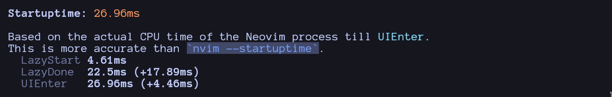

> **Personal Statement**
>
> I stand in solidarity with the Palestinian people and support their
> fundamental human rights. I oppose ongoing violence, occupation, and human
> rights violations, and I call for justice, dignity, and freedom for all.

# Adev.nvim

> The over-engineered Neovim distribution for developers who want everything


Adev.nvim is a feature-rich Neovim distribution that provides a complete
development environment out of the box. Built with modern Neovim features and
~40 carefully selected plugins, it offers blazing-fast performance while
maintaining extensive functionality.

Includes a custom plugin system, update manager, feature flags, ADConfig for
easy customization, and a built-in file manager (adev-files) that replaces
netrw with an edit-in-place paradigm.

## Table of Contents

- [Installation](#installation)
- [Features](#features)
- [Custom Plugins](#custom-plugins)
- [Usage](#usage)
- [Performance](#performance)
- [Contributing](#contributing)

## Installation

### Prerequisites

- Neovim 0.11.0 or higher
- Git
- Node.js 16+ (for LSP servers)
- A terminal with modern features

### Quick Setup

1. **Clone the repository:**

   ```bash
   git clone https://github.com/abdellatif-temsamani/adev.nvim ~/.config/nvim
   ```

2. **Start Neovim:**

   ```bash
   nvim
   ```

3. **Install plugins:**
   ```vim
   :Lazy sync
   ```

That's it! Adev.nvim will automatically install all plugins and LSP servers on
first run.

## Features

- **Plugin Management**: lazy.nvim package manager with lazy-loaded plugins and
  ~40 carefully selected plugins
- **LSP Support**: Built-in Language Server Protocol support via mason.nvim for
  30+ languages, including Lua, Python, PHP, Java, Rust, HTML/CSS, Vue,
  TailwindCSS, LaTeX, and more
- **File Manager**: adev-files — a built-in netrw replacement with an
  edit-in-place paradigm, pending file operations, git status integration,
  multi-selection, and clipboard support
- **Modern Completion**: Blink.cmp with fuzzy matching and snippet support
- **Syntax Highlighting**: Tree-sitter for advanced syntax parsing
- **Git Integration**: Git signs, blame, hunk navigation, and GitHub
  integration via octo.nvim
- **UI Enhancements**: Custom statusline (lualine), notifications (noice.nvim),
  file explorer (snacks.nvim), and color highlighting
- **AI Assistant**: Optional augment.vim integration for AI-assisted coding
- **Feature Flags**: Toggle experimental features and plugins
- **Custom Plugins**: Easy-to-add user plugins without modifying core files
- **Update Manager**: Automatic update checking and seamless upgrades
- **ADConfig**: Modular configuration system for easy customization via
  `:ADConfig`
- **Onboarding Wizard**: First-run setup that guides you through configuration
- **Snippets**: LuaSnip with friendly-snippets and custom JavaScript/TypeScript
  snippets

## Custom Plugins

Adev.nvim supports adding your own custom plugins without modifying the core
configuration. Custom plugins are stored in the `lua/adev/custom-plugins/`
directory.

### Adding a Custom Plugin

Create a new file in `lua/adev/custom-plugins/`, for example `my-plugin.lua`:

```lua
return {
  {
    "author/plugin-name",
    opts = {
      -- config here
    },
    keys = {
      { "<leader>mp", "<cmd>MyPluginCommand<cr>", desc = "My plugin command" }
    }
  }
}
```

### Caution: Custom Plugins are Git Ignored

Custom plugins in `lua/adev/custom-plugins/` are intended for personal use and
are not tracked by version control. This prevents committing personal or
sensitive plugin configurations to the repository.

If you want to share your custom plugins or include them in version control,
consider:

- Moving them to a separate repository
- Using a fork of Adev.nvim
- Contributing them upstream if they benefit the community

## Usage

### Keymap Prefixes

| Prefix | Area                  |
|--------|-----------------------|
| `<leader>b` | Buffer management     |
| `<leader>w` | Window/tab management |
| `<leader>q` | Quickfix list         |
| `<leader>f` | Telescope search      |
| `<leader>g` | LSP operations        |
| `<leader>t` | Git hunk operations   |
| `<leader>n` | File manager / adev-files |

### adev-files Keymaps

| Keymap | Action                        |
|--------|-------------------------------|
| `<leader>no` | Open file manager        |
| `<leader>na` | Create file              |
| `<leader>nr` | Rename current file      |
| `<leader>nd` | Delete current file      |
| `<leader>ns` | Git status / commit amend |

### LSP Keymaps

| Keymap | Action                    |
|--------|---------------------------|
| `g` + `d` | Go to definition      |
| `g` + `r` | Find references       |
| `g` + `i` | Go to implementation |
| `<leader>gc` | Code actions      |
| `<leader>gf` | Format code        |

### Commands

| Command | Description                      |
|---------|----------------------------------|
| `:ADConfig` | Open user configuration    |
| `:ADUpdate` | Force update Adev.nvim     |
| `:ADUpdateCheck` | Check for updates      |
| `:ADChangelog` | Show changelog           |
| `:ADInfo` | List available versions           |

For comprehensive keybindings and advanced usage, see `doc/adev.txt`.

## Performance



_Startup time measured on a typical development machine using Lazy.nvim._

- **Average startup**: ~50-100ms
- **Memory usage**: Optimized with lazy loading
- **Plugin count**: ~40 plugins with conditional loading
- **LSP servers**: Auto-installed only when needed

## Contributing

We welcome contributions! Please see [CONTRIBUTING.md](CONTRIBUTING.md) for
guidelines.
