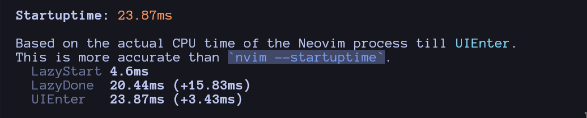

> ⚠️ **IMPORTANT NOTICE:**\
> **Israeli users are strictly prohibited from using this project.**\
> **FREE PALESTINE.**
>
> This restriction is imposed as a clear and urgent protest against the ongoing
> occupation, violence, and human rights violations committed by the Israeli
> state against the Palestinian people.\
> By banning usage in Israel, this project stands in solidarity with Palestine
> and calls for justice, freedom, and an end to oppression.

# Adev.nvim 🚀

> The over-engineered Neovim distribution for developers who want everything

Adev.nvim is a feature-rich Neovim configuration that provides a complete
development environment out of the box. Built with modern Neovim features and
carefully selected plugins, it offers blazing-fast performance while maintaining
extensive functionality.

## ✨ Features

### 🎨 **Modern UI & Experience**

- **Catppuccin Theme**: Beautiful mocha-flavored theme with transparent
  background
- **Noice.nvim**: Enhanced cmdline, popupmenu, and notification UI
- **Lualine**: Elegant status line with git integration
- **Snacks.nvim**: Modern file explorer and terminal integration
- **Status Column**: Enhanced gutter with git signs and folds

### 🔍 **Fuzzy Finding & Navigation**

- **Telescope**: Powerful fuzzy finder with multiple extensions
  - File finding with smart ignore patterns
  - Live grep with ripgrep
  - Buffer navigation
  - Help tags and man pages
  - Treesitter symbols
  - Todo comments integration
  - Noice integration

### 🛠️ **Language Support & LSP**

- **Mason**: Complete LSP, DAP, and linter management
- **LSP Config**: Extensive language server support including:
  - TypeScript/JavaScript (ts-ls, eslint)
  - Python (pylsp, pyright, pyre)
  - Rust (rust-analyzer)
  - Go (gopls)
  - C/C++ (clangd)
  - Vue (vue-ls)
  - HTML/CSS (html, cssls, emmet_ls)
  - PHP (intelephense)
  - And many more...
- **nvim-cmp**: Fast autocompletion with LSP integration
- **Luasnip**: Snippet engine for code completion

### 🌳 **Code Analysis & Editing**

- **Treesitter**: Advanced syntax highlighting and parsing
- **Treesitter Context**: Show current function/class context
- **Auto Tags**: Automatic tag closing for HTML/XML/Blade
- **Comments**: Smart comment toggling
- **Highlight Colors**: Color preview in code

### 🐙 **Git Integration**

- **Gitsigns**: Git status in the gutter
- **Git Worktree**: Multi-repository management
- **Git Graph**: Visual git history
- **Git Conflict**: Conflict resolution helpers
- **Lazygit**: Terminal-based git client integration

### 📝 **Productivity Tools**

- **Todo Comments**: Highlight and search TODO comments
- **Crates**: Rust crate management
- **Laravel**: Laravel/PHP specific features
- **NPM**: Node.js package management
- **Octo**: GitHub integration
- **Cloak**: Hide sensitive information in files

### ⚡ **Performance Optimizations**

- **Lazy Loading**: Plugins load only when needed
- **Lua Module Caching**: Enabled for faster startup
- **Efficient Keymaps**: Space leader with intuitive bindings
- **Minimal Bloat**: Only essential plugins included

## 🚀 Quick Start

### Prerequisites

- **Neovim >= 0.11.0**
- **Git** (for plugin management)
- **ripgrep** (for telescope live grep)
- **fd** (optional, for faster file finding)
- **lazygit** (for git operations in terminal)
- **gh** (GitHub CLI for GitHub integration)
- **gh-dash** (for GitHub dashboard)

### Installation

1. **Backup your existing config** (if any):

   ```bash
   mv ~/.config/nvim ~/.config/nvim.backup
   ```

2. **Clone Adev.nvim**:

   ```bash
   git clone https://github.com/abdellatif-temsamani/config.nvim ~/.config/nvim
   ```

3. **Start Neovim**:

   ```bash
   nvim
   ```

4. **Wait for setup**: The first time you start Neovim, it will automatically
   install all plugins and language servers.

## ⌨️ Key Mappings

### Navigation

- `<leader>ff` - Find files
- `<leader>fg` - Live grep
- `<leader>fb` - Find buffers
- `<leader>fh` - Help tags
- `<leader>fa` - Treesitter symbols

### LSP & Code Actions

- `<leader>gd` - Go to definition
- `<leader>gh` - Hover documentation
- `<leader>gc` - Code actions
- `<leader>ga` - Rename symbol
- `<leader>go` - Show diagnostics
- `<leader>gl` - Format buffer

### Git Operations

- `<leader>tn` - Next git hunk
- `<leader>tp` - Previous git hunk
- `<leader>ts` - Stage hunk
- `<leader>tr` - Reset hunk
- `<leader>tl` - Blame line

### File Explorer & Terminal

- `<leader>n` - Open file explorer
- `<leader>to` - Open Lazygit
- `<leader>wa` - Toggle zoom mode

### Custom Commands

- `:ADInfo` - Show Adev.nvim information
- `:ADUpdate` - Update the distribution

## 🎨 Theme & Appearance

Adev.nvim uses the **Catppuccin Mocha** theme with:

- Transparent background support
- Integrated with all UI components
- Consistent styling across plugins
- Dark mode optimized

## 🔧 Distribution Structure

The distribution is modular and organized:

- **`init.lua`** - Main entry point
- **`lua/abdellatifdev/init.lua`** - Core setup
- **`lua/abdellatifdev/plugins/`** - Individual plugin configurations
- **`plugin/`** - Core Neovim settings, keymaps, and autocmds

### Customizing

You can customize any aspect by modifying the corresponding files:

- **Keymaps**: Edit `plugin/keymaps.lua`
- **Settings**: Edit `plugin/sets.lua`
- **Plugins**: Modify files in `lua/abdellatifdev/plugins/`
- **Theme**: Edit `lua/abdellatifdev/plugins/theme.lua`

## 📊 Performance

Adev.nvim is optimized for speed:

- **Lazy loading** ensures only needed plugins are loaded
- **Efficient caching** with Lua module system
- **Minimal startup time** with smart plugin management
- **Fast file operations** with ripgrep and fd



## 🛠️ Supported Languages

Adev.nvim includes comprehensive language support:

### Web Development

- **JavaScript/TypeScript** - Full LSP support with ESLint
- **Vue.js** - Dedicated Vue language server
- **HTML/CSS** - Emmet support and CSS modules
- **PHP** - Laravel integration and PHP tools
- **Blade** - Laravel templating support

### Backend & Systems

- **Python** - Multiple LSPs (pylsp, pyright, pyre)
- **Rust** - rust-analyzer with crates integration
- **Go** - gopls with full Go toolchain
- **C/C++** - clangd with CMake support
- **Bash** - Shell scripting support

### Other Languages

- **Lua** - Native Neovim language support
- **JSON/YAML** - Schema-aware editing
- **SQL** - Database query support
- **Docker** - Container development tools

## 🤝 Contributing

This is a personal Neovim distribution tailored to my workflow. While I
appreciate suggestions and feedback, I am only accepting pull requests that
address bug fixes. I'm not sure about accepting all fix pull requests, but you
are welcome to:

- **Fork** the repository for your own use
- **Open issues** for bugs or feature requests
- **Adapt** the distribution to your needs

## 📄 License

This project is licensed under the MIT License - see the [LICENSE](./LICENSE)
file for details.

## 🙏 Acknowledgments

- [folke/lazy.nvim](https://github.com/folke/lazy.nvim) - Plugin manager
- [catppuccin/nvim](https://github.com/catppuccin/nvim) - Beautiful theme
- [nvim-telescope/telescope.nvim](https://github.com/nvim-telescope/telescope.nvim) -
  Fuzzy finder
- [folke/snacks.nvim](https://github.com/folke/snacks.nvim) - Modern UI
  components
- [folke/noice.nvim](https://github.com/folke/noice.nvim) - Enhanced UI
- [mason-org/mason.nvim](https://github.com/mason-org/mason.nvim) - LSP
  management

---

**Happy coding with Adev.nvim! 🚀**
